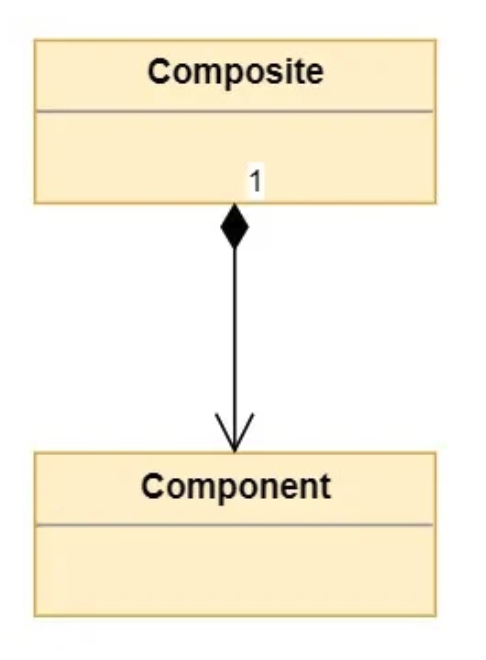

# Inheritance

We implement inheritance by creating a sub class that inherit attributes and methods from a base class.

This models an <strong> is a </strong> relationship.

E.g. a car <strong> is a </strong> vehicle.

# Composition
We implement composition by combining objects of other types.

Classes that contain objects of other classes are composites.

Classes that are used to create more complex types are referred to as components.

This models a <strong> has a </strong> relationship.

